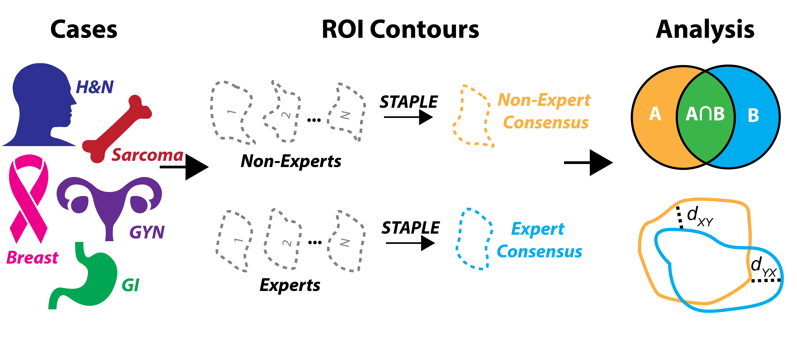

# Prospective acceptability benchmarking from the Contouring Collaborative for Consensus in Radiation Oncology (C3RO) Crowdsourced Initiative for Multi-Observer Segmentation

## Repo for code related to C3RO project. Pre-print available at: https://www.medrxiv.org/content/10.1101/2022.09.23.22280295v1. Manuscript currently under peer-review, when accepted link will be updated here. Corresponding image sets used for this project are avaliable on Figshare (data doi: 10.6084/m9.figshare.21074182). Data descriptor located at: https://www.medrxiv.org/content/10.1101/2022.10.05.22280672v1. All data has been anonymized to remove patient PHI.  

### This repo contains the following files:  
Jupyter notebook of main script (C3RO.ipynb) - This notebook contains all the code neccessary to perform the analyses outlined in the manuscript.  

CSV files associated with Turing test analysis (Turing_test_slice_key_v2_FULLYANONYMIZED_FINAL.csv, Turing_test_subset_information_withanonkey_v2_FULLYANONYMIZED_FINAL.csv) - CSV files that were used as intermediates in generating Turing test results.  

Excel files associated with Turing test analysis (Turing_test_v2_obs1.xlsx, Turing_test_v2_obs2.xlsx, Turing_test_v2_obs3) - Excel files that each observer produced when perfomring the visual Turing test; used for analysis.  

### Utilized the following core Python (version 3.8.8) libraries in project:  

DicomRTTool version 0.4.2.  
SimpleITK version 2.1.1. 
Numpy version 1.20.1. 
Pandas version 1.4.2.  
Surface-distance vresion 0.1  
Nibabel version 4.0.1.  
Statannotations version 0.4.4  
Matplotlib version 3.5.1. 
Seaborn version 0.11.2.  

### Note: The Jupyter Notebooks are quite large, which may present difficulties when trying to view them through the online Github browser preview. To successfully view it them in the online Github browser you may need to download the notebook (top right button) and then navigate back to the corresponding page.  

### Collaboration between Fuller lab at MDA and Gillespie lab at MSK. For more information on the Fuller lab and associated projects please visit: https://www.mdanderson.org/research/departments-labs-institutes/labs/fuller-laboratory.html. 
